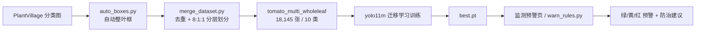

# cxy 番茄病害智能识别与预警系统

> **一句话介绍**：开箱即用的番茄病害智能识别系统——YOLO11m 十类病害检测 + PySide6 桌面训练平台 + 三级预警，代码、权重与复现管线全公开。

基于 Ultralytics YOLO11m 的番茄 10 类病害/虫害目标检测与三级预警系统，配套 PySide6 桌面训练平台。

系统覆盖完整闭环：**数据自动标注 → 数据集合并 → 迁移学习训练 → 多病害识别 → 分级预警**。

## 特性

- 10 类番茄病害/虫害检测（健康、早疫病、晚疫病、叶霉病、细菌性斑点、斑枯病、靶斑病、花叶病毒、黄化曲叶病毒、红蜘蛛）
- 桌面训练平台（PySide6）：项目概览、训练、数据预标注、图像推理、数据处理、模型报告、监测预警 7 个页签
- 零人工标注管线：PlantVillage 分类图自动生成整叶框标签
- 数据集合并工具：MD5 全局去重 + 按主类别 8:1:1 分层划分
- 预警规则引擎：置信度 + 患病叶片占比 + 连续帧确认，输出 绿/黄/红 三级预警与防治建议
- 迁移学习继承：从已有模型继续训练新类别（`cls_remap` 自动重映射头部）

## 系统架构



## 技术栈

| 组件 | 版本 |
|---|---|
| Python | 3.11 |
| PyTorch | 2.13.0+cu130（CUDA 12.6+） |
| Ultralytics YOLO | 8.4.x（YOLO11m） |
| GUI | PySide6 |
| 图像处理 | OpenCV |

## 快速开始

环境要求：Windows 10/11，Python 3.11+，PyTorch + CUDA 12.6+。

```bash
pip install ultralytics pyside6 opencv-python
```

启动桌面平台：

```bash
python yolo_trainer_app.py
# 或直接双击 run.bat
```

用仓库内权重直接跑推理/预警（先下载 `weights/tomato10_best.pt`）：

```bash
python warn_rules.py --model weights/tomato10_best.pt --source <图片或文件夹> --out warn_out
```

完整复现（从公开数据集重建训练集并重新训练）见下方"数据集管线"与"训练与结果"。

## 数据集管线

原始数据：PlantVillage 番茄 10 类（约 1.8 万张叶片特写图）。

```text
E:\tomato\<类文件夹>                原始分类图（10 个类目录）
E:\tomato\labels\<类文件夹>         auto_boxes.py 生成的整叶框 YOLO 标签
E:\tomato\tomato_multi_wholeleaf\  合并后的最终数据集
```

类别顺序（与标签索引一一对应，`healthy`/`early_blight` 固定在前两位以便兼容旧标注）：

```yaml
names:
  0: healthy
  1: early_blight
  2: late_blight
  3: leaf_mold
  4: bacterial_spot
  5: septoria_leaf_spot
  6: target_spot
  7: tomato_mosaic_virus
  8: yellow_leaf_curl_virus
  9: spider_mites
```

最终数据集：**18,145 张**（全部整叶框标注），划分 train 14,511 / val 1,811 / test 1,823。

## 训练与结果

训练命令（迁移学习，从已有模型继续）：

```bash
yolo detect train data=E:/tomato/tomato_multi_wholeleaf/dataset.yaml \
  model=yolo11m.pt epochs=50 imgsz=640 batch=16 device=0 close_mosaic=10
```

当前验证结果（v2 整叶标注模型，YOLO11m，imgsz=640，50 轮，val 集）：

| 指标 | 数值 |
|---|---|
| Precision | 0.999 |
| Recall | 0.999 |
| mAP50 | 0.995 |
| mAP50-95 | 0.995 |

仓库内模型权重：`weights/tomato10_best.pt`（v2 整叶标注模型，mAP50-95 0.995，可直接下载使用）

> 注：v2 模型在统一整叶标注数据集上训练，输出为"一叶一框"，与预警口径完全对齐；
> 当前指标在 PlantVillage 风格叶片特写图上已接近饱和，田间实拍图仍需补标微调验证。

## 预警规则

输入：模型检测结果。输出：绿 / 黄 / 红 三级。

| 等级 | 判定条件 | 动作 |
|---|---|---|
| 绿 | 未检出患病叶片 | 继续监测 |
| 黄 | 检出患病叶片（单叶或低占比） | 3 天后复查 |
| 红 | 高危害类别（晚疫病/病毒病），或患病叶片占比 ≥ 阈值（默认 0.5）且患病叶片 ≥ 2 | 立即处理，附防治建议 |

关键实现：

- 重叠框去重（IoU ≥ 0.5 视为同一叶片），保证"患病叶片数"真实
- `--confirm N`：同一场景连续 N 帧确认后才升级为红色，降低误报
- 每个类别内置防治建议（杀菌剂/杀螨剂/病毒病先治传毒媒介等）

## 平台使用

```bash
python yolo_trainer_app.py
# 或直接双击 run.bat
```

| 页签 | 功能 |
|---|---|
| 项目概览 | 数据集与最近训练概览 |
| 训练 | 训练参数、数据增强、数据生成/浏览、权重管理 |
| 数据预标注 | 用已有模型批量生成 YOLO 标签 |
| 图像推理 | 单图/文件夹推理 |
| 数据处理 | 自动分类、批量重命名、数据整合 |
| 模型报告 | 训练曲线、混淆矩阵、验证指标 |
| 监测预警 | 批量扫描图片，输出三级预警与防治建议 |

## 文件结构

```text
YoloTrainer/
├── yolo_trainer_app.py       # 主程序（PySide6 桌面平台）
├── train_worker.py           # 训练子进程
├── preannotate_worker.py     # 预标注子进程
├── data_process_worker.py    # 数据处理子进程
├── auto_boxes.py             # 分类图 → 整叶框 YOLO 标签
├── merge_dataset.py          # 数据集合并/去重/分层划分
├── warn_rules.py             # 预警规则引擎
├── weights/
│   └── tomato10_best.pt      # v2 整叶标注模型权重
├── run.bat                   # 一键启动
└── 使用说明.txt
```

## 路线图

- [x] 10 类整叶标注数据集
- [x] 10 类检测模型（v1）
- [x] 监测预警页与规则引擎
- [x] 重训整叶标注模型（v2，mAP50-95 0.995）
- [ ] test 集独立复测
- [ ] 田间实拍数据补标与微调
- [ ] 摄像头实时监测

## 致谢与许可

- 数据集：PlantVillage（学术用途），复现管线见 `auto_boxes.py` / `merge_dataset.py`
- 框架：Ultralytics YOLO、PyTorch、PySide6
- 项目仅供学习与研究使用
